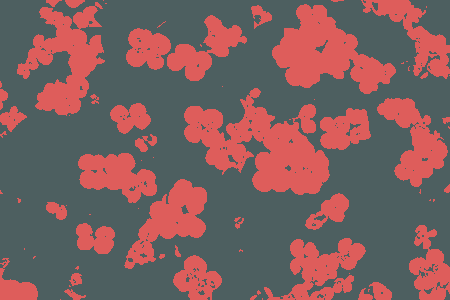

# kmeans-colors
[](https://github.com/okaneco/kmeans-colors)
[](https://crates.io/crates/kmeans-colors)
[](https://docs.rs/kmeans_colors)

Calculate the `k` average colors in an image using k-means clustering with
k-means++ initialization.

`kmeans-colors` wraps around a generic [k-means library][lib] that supports
Lloyd's and Hamerly's algorithms for arbitrary data types. k-means can find the
dominant colors or color palette of an image. Other applications in this crate
are binarization and "color style" transfer.

[lib]: https://docs.rs/kmeans_colors/

This is a personal fork of the `kmeans-colors` library, optimized for Windows (haven't tested on other platform), removes application functionality and breaks the dependency on the `palette` library by using `[f32; 3]` (`[r, g, b]`) instead of `Srgb` and `Lab` in the `palette` to improve computational efficiency. Using such deeply specialized forks may lead to unknown errors. The `get_kmeans_hamerly` function is broken in this fork.

This fork is optimized using `rayon` and small_rng from the `rand` library.

Example with `rayon`, `rand` and `image`:
```rust
use image::{io, DynamicImage};
use rayon::prelude::*;
use kmeans_colors::{get_kmeans_hamerly, Kmeans};

fn main() -> Result<(), Box<dyn std::error::Error>> {
   let img: DynamicImage = io::Reader::open(
    "path",
  )?.decode()?;
  
  let k: usize = 1;
  let max_iter: usize = 10;
  let converge: f32 = 1.0;
  let z: Vec<[f32; 3]> = img
    .into_rgb32f()
    .par_chunks_exact(3)
    .map(
      |rgb: &[f32]| [rgb[0], rgb[1], rgb[2]]
    )
    .collect();

  let run_result: Kmeans<[f32; 3]> = get_kmeans_hamerly(
    k,
    max_iter,
    converge,
    false,
    &z
  );
  println!("{:#?}", run_result.centroids);

  Ok(())
}
```




```toml
[dependencies.kmeans_colors]
version = "0.5.*"
git = "https://github.com/NightFeather0615/kmeans-colors"
```

## License
This crate is licensed under either
- the [MIT License](LICENSE-MIT), or
- the [Apache License (Version 2.0)](LICENSE-APACHE)

at your option.
